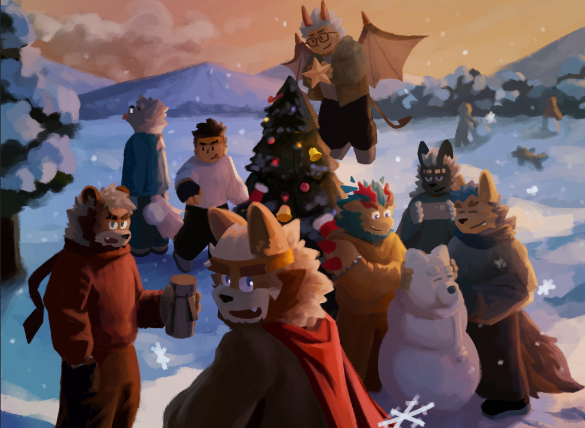

<!--
  yc-eagle · GitHub Profile README
  Public info only (itch.io YC-Eagle / bonjour.bio/yc-eagle / ORCID).
  Last synced with the master resume: 2026-10-08
-->

  

  
  
  
  
  
  
  
  

---

## Who I am

**YC Eagle (轶辰)** — founder & director of [LILAC Puzzle](https://linktr.ee/lilacpuzzle) (est. 2022); an independent puzzle designer and a practitioner-researcher working across game studies, computational media and player-behaviour research.

I work across `player behaviour & engagement` · `data visualisation` · `puzzle & game mechanic design` · `interactive media` · `rapid prototyping`. Core focus: **measuring why players keep playing** (behavioural telemetry, engagement metrics, game user research), **Hanzi-based puzzle systems**, and **hybrid-reality / ARG mechanics** — the idea that *a puzzle can work as a medium* for learning, connection and cultural expression.

Currently a Japanese major at Beijing Foreign Studies University (2024–2028), based in Beijing. Japanese TEM-4 with distinction (90/100); English TEM-4, CET-4/CET-6. Planning graduate research abroad in game user research / computational media / HCI after graduating in June 2028.

  

## Selected facts & honors

- **Research & dissemination** — adapted Prof. Hiroyuki Iida's *Game Refinement Theory* with a multi-disciplinary team (initiated direct contact with his lab; obtained the original papers; organised the translation and public-facing write-ups; the retrospective report drew 50k+ views within 3 days). Observer report for the 3rd Boya International E-Games Academic Conference (VGARC 2026): 250k+ organic impressions and 50k+ reads.
- **Talks & publications** — invited speaker at *Celebration of Mind* (G4G16, China) on online puzzle-community practice (case: LILAC); invited speaker at **NUS Hackers** (National University of Singapore) winter-break talk, 2026–2027; book chapter *Guess, Cut, Rearrange: Hanzi Factory* (*Mian Mian Ju Dao* 02, 2025; ORCID type: `book-chapter`).
- **Hackathon & product** — AdventureX 2026, team "Mo Yu Shuang" product-operations lead; built **Tunta**, a zero-trust snapshot-based semantic retrieval extension — featured by Cyzone.
- **Teaching** — core instructor, judge and academic host, Perk Summit 2026; designed and delivered a PBL course on campus-based multimedia puzzle hunts (7-day camp in Chongqing); also ran a puzzle-as-general-education session at the Superellipse Math Festival, Chengdu Contemporary Art Museum.
- **Community & events** — founded NAPCA (national school puzzle-club association) and the first National School Puzzle Hunt (NSPH); core planner of Puzzlers' Day (5 cities, 2024–2025); initiator of *China Puzzle Collection*; co-initiator of China Puzzle Award (CPA); delivered China's first offline school real-world puzzle hunt (100+ teams) and a ~500-team online event; collaborations with 20+ independent brands.
- **Community numbers** — LILAC Puzzle: 300+ original articles (weekly double updates for over a year), one post at 100k+ impressions, 5,000+ users across platforms and 10k+ daily messages in the community Discord, whose management bot I built myself. Campus-wall matrix: 3M+ cumulative views. Alumni network: admin of a 1,000+ member cross-cohort group.
- **Media & publishing** — co-planned a Bilibili rhythm-game variety series (~1M plays); editor of the sci-fi magazine *Future Dream*; co-creator of the math-and-art magazine *Mian Mian Ju Dao*; original worldbuilding and merch line for LILAC; 9 years of hands-on content operations with 1M+ cumulative views.

## Selected events & interactive projects

| Project | Role | Tags |
| --- | --- | --- |
| **[LILAC Puzzle](https://linktr.ee/lilacpuzzle)** — Chinese puzzle-culture community & content brand (est. 2022) | founder & director | `community` `content` `bilingual` `brand` |
| **[infoflow-simulator](https://github.com/yc-eagle/infoflow-simulator)** — telemetry dashboard for information-engagement analytics | author (HTML, MIT) | `data-viz` `dashboard` `telemetry` |
| **[Tunta](https://tunta.xyz)** — zero-trust snapshot-based semantic retrieval extension | product-operations lead, AdventureX 2026 | `zero-trust` `RAG` `snapshot` `browser-extension` |
| **[LILAC: SAŊ](https://yc-eagle.itch.io/lilac-sang)** — cross-city location-based ARG | independent producer & core-mechanic designer | `location-based` `ARG` `hybrid-reality` `cross-city` |
| **Game Refinement Theory** — adaptation & public dissemination (Prof. Hiroyuki Iida) | researcher & organiser | `game-theory` `translation` `science-communication` |
| **Puzzlers' Day** — national multi-city puzzle convention (5 cities, 2024–2025) | core planner & coordinator | `community` `multi-city` `event` |
| **NSPH** — first nationwide school puzzle hunt (NAPCA) | founder & lead | `education` `Puzzle-Hunt` `nationwide` |
| **Signs Out of Context** *(Shanghai)* — urban orienteering hunt built on street-sign text memes | on-site event designer | `city-walk` `orienteering` `street-signs` `meme-hunting` |
| **China Puzzle Collection** — anthology & dataset of Chinese puzzles | initiator & committee member | `curation` `open-data` `community` |

  

## Find me

| Platform | Me (YC Eagle) | LILAC Puzzle |
| --- | --- | --- |
| GitHub | [yc-eagle](https://github.com/yc-eagle) | [LILAC-Puzzle-Dev](https://github.com/LILAC-Puzzle-Dev) |
| LinkedIn | [yc-eagle](https://www.linkedin.com/in/yc-eagle) | — |
| X / Twitter | [@YC_Eagle](https://x.com/YC_Eagle) | [@LILAC_Puzzle](https://x.com/LILAC_Puzzle) |
| Instagram | [eagle_yc](https://www.instagram.com/eagle_yc) | [lilac_puzzle_official](https://www.instagram.com/lilac_puzzle_official) |
| RedNote | [轶辰 Eagle](https://xhslink.com/m/GCR3J8Pobd) | [LILAC 丁香谜](https://xhslink.com/m/39FFF4MGl5s) |
| Discord | [@yc_eagle](https://discord.com/invite/Aqc69prM) | [join the LILAC server](https://discord.com/invite/ANNqeX82XR) |
| WeChat | — | [LILAC 丁香谜 公众号](https://mp.weixin.qq.com/s/W8pKPlPn6-YzpTcsr0EVdw) |
| Website | [Bonjour!](https://bonjour.bio/yc-eagle) · [Itch.io](https://yc-eagle.itch.io/) | [Linktree](https://linktr.ee/lilacpuzzle) |
| Academic | [ORCID 0009-0004-3152-3717](https://orcid.org/0009-0004-3152-3717) | — |

<!--
  Edit tips:
  1) Typing lines  → edit `lines=` params (URL-encode spaces as +)
  2) Photos        → files in repo root: lilac-main-image.jpeg / memories-with-friends.png
  3) Keep in sync  → this file mirrors 求职用\00-全局总览\蒋奕诚-通用简历-全量母版.html
-->
